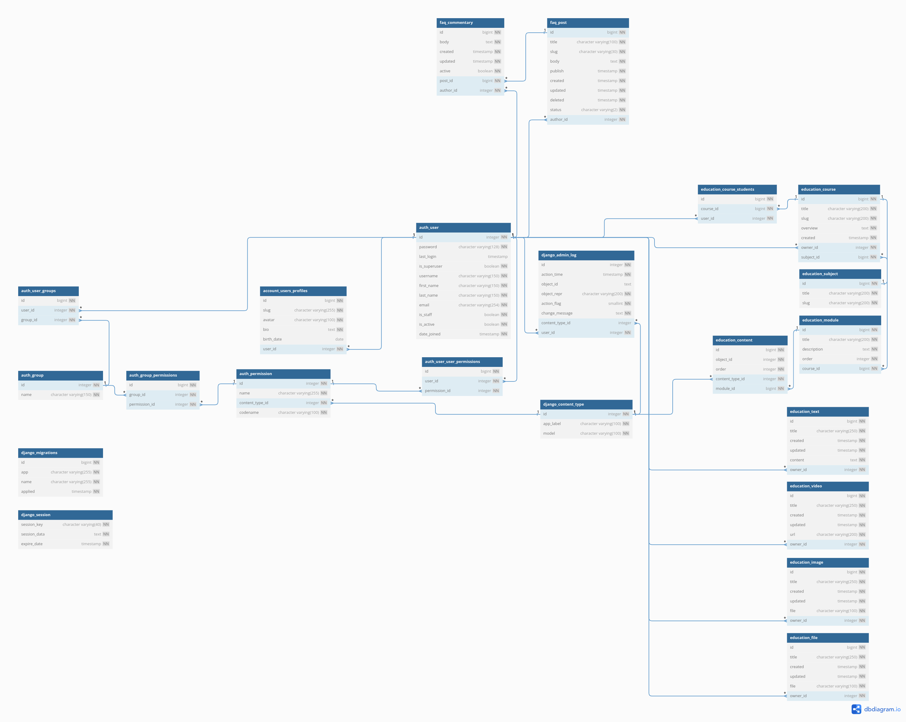
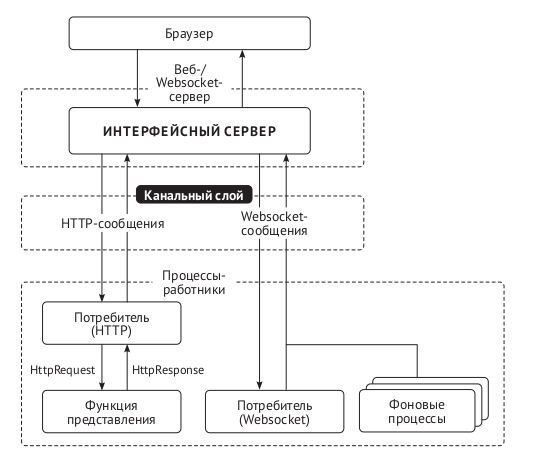

# Платформа для создания курсов "TaskMetrics"

**Название проекта**: TaskMetrics

**Описание**: TaskMetrics - это веб-приложение, разработанное для создания платформы для обучения. 
Проект создан с целью предоставить командам и индивидуальным специалистам эффективный инструмент 
для создания курсов и коммуникации между студентами и автором курсов.

## Основные технологии разработки

- Python 3.10
- Django 4.2
- Django-Channels (для работы с WebSocket)
- PostgreSQL 15
- Redis 6.0
- Docker
- NGINX
- GIT

## Основные цели проекта

1. **Упрощение обучения новых сотрудников**: Предоставить удобный интерфейс для создания, 
отслеживания и управления обучающими курсами по проектам.
2. **Совместная работа**: Обеспечить возможность совместной работы в реальном времени над одним курсом.
3. **Старт для развития удобной внутренней платформы**: Создать веб-приложение, способное 
масштабироваться.

## Задачи проекта

1. **Разработка удобного интерфейса**: Создание интуитивно понятного интерфейса для быстрого и 
простого взаимодействия с курсами.
2. **Реализация чат-комнат**: Знакомство с технологией WebSocket
3. **Документация**: Написание подробной документации для будущих пользователей и разработчиков.
4. **Тестирование и логирование**: Проведения тестирования основного функционала проекта и ведение
логирования для отладки
5. **Развертывание проекта на сервере**: Создание производственной среды, обеспечение защиты с 
помощью SSL/TLS, использование DockerCompose и раздача Django через NGINX

## Функциональности проекта
<details>
<summary><b>Схема БД</b></summary>   
<a href="https://dbdiagram.io/d/655dc8413be14957877f5cd2">Интерактивная схема базы данных</a>    


</details>

<details>
<summary><b>Реализация модуля пользователя</b></summary>

Модуль account реализован для:
 * Работы с профилем пользователей
 * Авторизации и аутентификации пользователей
 * Связи модуля education и пользователей

Частично логика из views была вынесена в отдельный слой services.

Для расширения модели пользователей было рассмотрено 4 способа расширения 
существующей модели пользователя:
- использование прокси-модели;
- использование связи один-к-одному с пользовательской моделью;
- создание модели пользователя с помощью расширения класса AbstractBaseUser;
- создание модели пользователя с помощью расширения класса AbstractUser.

Для расширения информации о пользователе было принято решение создать модель
профиля и связать с пользователем с помощью OneToOneField. 

- Такое решение является более простым, так как не тянет за собой 
необходимость обновления связей через settings.py, что крайне затруднительно, 
если это делается после начала проекта. 
- Нет необходимости в особой форме аутентификации, поэтому нет необходимости в расширении с помощью
AbstractBaseUser или AbstractUser.
- Есть необходимость в хранении дополнительной информации о пользователе, 
поэтому использование прокси модели не подходит

</details>

<details>
<summary><b>Реализация модуля обучения</b></summary>

Модуль education реализован для CRUD операций с курсами, 
модулями и контентом.

Сами курсы построены по принципу "матрешки", то есть существует некоторая
**Сущность** проекта (например "SQL"), в которой может быть несколько **Курсов** 
(например, "Введение в SQL" и "SQL для продвинутых"), в каждом курсе может быть несколько 
**Модулей** (подобно главам в книге), а в каждом модуле может быть несколько **Контента** 
(файлы, видео, текст или картинки)
</details>

<details>
<summary><b>Реализация чата</b></summary>

Модуль chat реализован следующим образом:

- Использование ASGI:
  - Использования channels (схема цикла запрос/ответа) 

  - Для реализации было выполнено:
    - Настройка потребителя (consumers.py)
    - Конфигурация маршрутизации (routing.py)
    - Реализация WebSocket-клиента с использование JavaScript
    - Активация канального слоя с использованием Redis
</details>

<details>
<summary><b>Логирование</b></summary>

Для того, чтобы упростить процесс отладки, было настроено логирование.
Посмотреть детальнее можно в файле app/config/logging_config.py

Все логирование от Django по умолчанию перехватывается для одинакового
форматирования, вывод в консоль при этом сохраняется (отдельный handler для консоли)

```
'formatters': {
        'standart': {
            'format': '%(asctime)s %(levelname)s %(name)s %(message)s'
        },
    }
```

Был также рассмотрен вариант использования кастомных MiddleWare, но так как Django MiddleWare 
работают на все представления, то во избежания непредвиденного поведения было принято решение 
отказаться от данного способа логирования.

</details>

<details>
<summary><b>Тестирование</b></summary>

Основной функционал проекта был протестирован с помощью pytest и парсеров с использованием
selenium и beautifulsoup

Фикстуры вынесены в отдельные файлы conftest для улучшения читаемости кода тестов

</details>

<details>
<summary><b>Развертывание проекта</b></summary>

</details>


## Установка и запуск
* Разделены настройки для локальной и производственной сред, файл *base.py*
является файлом базовых настроек, содержащий общие настроечные параметры 
(стандартный settings.py)
* Настройки для локальной среды находятся в local.py
* Настройки под производственную среду находятся в prod.py

Для просмотра структуры проекта: `tree -I 'venv|__pycache__'`


<details>
<summary><b>Для локального запуска: </b></summary>

```
python manage.py runserver --settings=config.settings.local
```

Чтобы не вводить флаг `--settings` каждый раз, можно ввести в терминале:
```
export DJANGO_SETTINGS_MODULE=config.settings.local
```
</details>

<details>
<summary><b>Для запуска с докера: </b></summary>

```
docker compose up
```

</details>

## Контакты